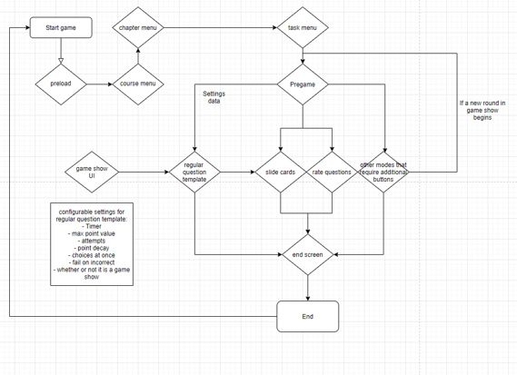
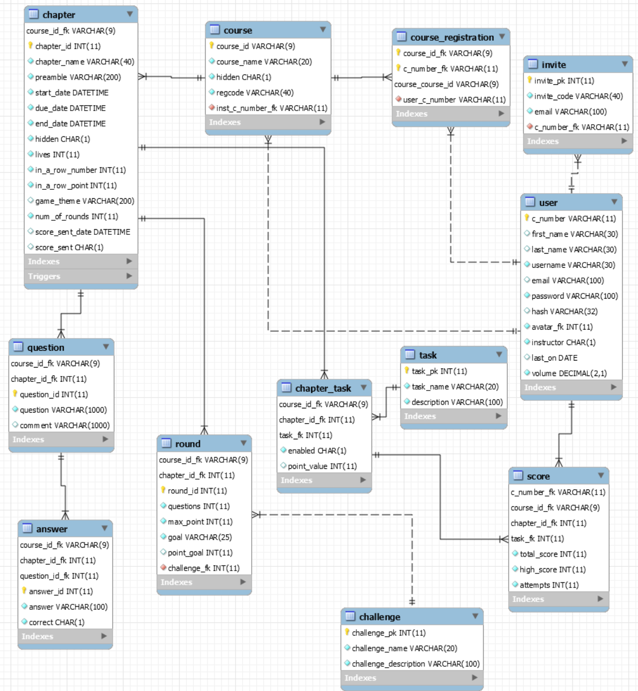

# awesominds2020
## Overview
Camosun College instructor Marty Donatelli developed the idea of the Game-Based Learning Project. The Awesominds team worked closely with Marty to develop Awesominds — a single-player, online game that uses course content and has an interface that is easy for students and instructors to use.

The testing effect is a proven technique to improve learning; students prepare for tests by taking practice tests. Unfortunately, student motivation to take tests is typically low. A digital game that has the player answer questions on course material can be an effective way to prepare for tests, but games like these are rare for college-level courses.

With the completion of this prototype, the team has refactored the existing application and enhanced the features by adding new game, fixing bugs, upgrading previous funtionalities.  

## Technology Stack

* **Front End**: HTML5, CSS3, JavaScript, PhaserII
* **Back End**: LAMP(Linux, Apache, MySQL, PHP)
* Microsoft Azure
* Workflow and Database Diagram
  *[Workflow]*
  
  *[Database Diagram]*
  
  

## Results
More information at [Awesominds 2020 Official Site](https://04wakeup.github.io/awesominds_website/)

## PHP & Apache Install

1) Update System and Software Packages
```sh
$ sudo yum update -y
$ sudo yum install wget nano screen telnet zip unzip -y
```

2) Install EPEL and REMI RPM’s Repository for CentOS 7
```sh
$ wget https://dl.fedoraproject.org/pub/epel/epel-release-latest-7.noarch.rpm
$ wget http://rpms.remirepo.net/enterprise/remi-release-7.rpm
$ sudo rpm -Uvh remi-release-7.rpm epel-release-latest-7.noarch.rpm
$ sudo yum --enablerepo=remi update remi-release
```

3) For PHP 7.0 with Apache (HTTPD)
```sh
sudo yum --enablerepo=remi-php70 install php70-php php70-php-pear php70-php-bcmath php70-php-pecl-jsond-devel php70-php-mysqlnd php70-php-gd php70-php-common php70-php-intl php70-php-cli php70-php php70-php-xml php70-php-opcache php70-php-pecl-apcu php70-php-pecl-jsond php70-php-pdo php70-php-gmp php70-php-process php70-php-pecl-imagick php70-php-devel php70-php-mbstring php70-php-soap php70-php-mcrypt php-mcrypt php-soap phpMyAdmin roundcubemail memcached php70-php-pecl-memcached php70-php-pecl-memcache php-opcache php-redis redis php70-php-redis php71-php-zip php71-php-pspell php-brotli
```

4) Edit php.ini Files
```sh
$ sudo vi /etc/php.ini
$ sudo vi /etc/opt/remi/php70/php.ini

== make sure ==
$ session.save_handler = files
$ session.save_path = /var/lib/php/session
$ soap.wsdl_cache_dir ="/tmp"

upload_max_filesize=100M (as per your need)
post_max_size = 100M (as per your need)

== info to check which php.ini is used now ==
$inipath = php_ini_loaded_file();
echo 'Loaded php.ini: ' . $inipath;

$ sudo chmod 777 /var/lib/php/session/
```

8) Reload Systemd Manager Configuration
```sh
$ sudo systemctl daemon-reload
```

9) Restart Apache / Nginx and PHP-FPM
```sh
$ sudo service httpd restart
```

## MySQL Install

1) Download & Install
```sh
sudo rpm -qplp mysql57-community-release-el7-11.noarch.rpm   ### very import -qplp
sudo rpm -ivh mysql57-community-release-el7-11.noarch.rpm
sudo yum install -y mysql-server
sudo systemctl status mysqld 
sudo systemctl start mysqld
sudo grep 'password' /var/log/mysqld.log  # at the frist line, there is password     ### ?>TI_tR)3Zi/

sudo vi /etc/my.cnf # then 
validate_password_policy=LOW
secure-file-priv='' at /etc/my.cnf
sudo systemctl restart mysqld
sudo tail -f /var/log/mysqld.log # check log

sudo mysql_secure_installation
 6pazshIiJ#j/
all 'Y'
- mysql login!
- log: check log : /var/log/mysqld.log
-restart
systemctl start mariadb.service (mysqld)
OR
service mariadb restart
OR
sudo systemctl restart mysqld
```

2) Account Management
```sh 
create user awesominds@localhost identified by 'Camosun$2020';
create database awesominds;
grant all on awesominds.* to awesominds@localhost;
grant all on awesominds.* to awesominds@'%' identified by 'Camosun$2020'; 
grant all privileges on awesominds.*   to awesominds@localhost identified by 'Camosun$2020';
grant all privileges on awesominds.*   to awesominds@'%' identified by 'Camosun$2020';
GRANT FILE ON *.* TO awesominds@localhost;    
GRANT FILE ON *.* TO awesominds@'%' ;
flush privileges;
```

3) Configuration for CSV Creation
```sh
SHOW VARIABLES LIKE "secure_file_priv";
Disable secure-file-priv='' at /etc/my.cnf
sudo chsh -s /bin/bash mysql # for login of mysql account
```

4) Migration
mysqldump -uroot  -p --opt awesominds > awesominds.sql
mysql -u root -p awesominds < ./awesominds.sql

## Etc Configuration

1) Azure(Network-inbound): 3306, 443(ssl), 80(http), 465(PHPMailer?)

2) OS(Local) - optional 
```sh
firewall-cmd --add-port=3306/tcp 
firewall-cmd --permanent --add-port=3306/tcp
AND /etc/my.cnf file.
[mysqld]
skip-networking=0
skip-bind-address
```
3) PHPMailer
this is important for http
```sh
- getsebool httpd_can_sendmail is Off then turn On it
   sudo setsebool -P httpd_can_sendmail 1
- may need sudo 'setsebool -P httpd_can_network_connect 1'
- disable_function = ...... delete exec for exec() in php.ini
```
4) ssh Keys
```sh
Copy .ssh to /home/awesominds/ 
It should contain your local public key
chmod 700 .ssh folder and rename it as authorized_keys as well or not stored credential .
Edit home….ssh/config/somefile.here
```

5) Timezone
```sh
sudo rm -f /etc/localtime
sudo ln -sf /usr/share/zoneinfo/America/Los_Angeles /etc/localtime
```
6) Git
```sh
sudo yum install git
```

> This is a Capstone Project at the last project teram at [Camosun College](htttp://www.camosun.ca/)


